## 前半の部： Momento Topics ハンズオン手順

このワークショップでは、Momento Topicsを深く掘り下げ、チャットアプリを作成しAWSのサービスに対して構築していきます。使用するサービスは以下の通りです、

* ユーザの写真を保存する用途で、Amazon S3
* データストアとしての DynamoDB
* ホスティング先として、AWS App Runner

全体のアーキテクチャ
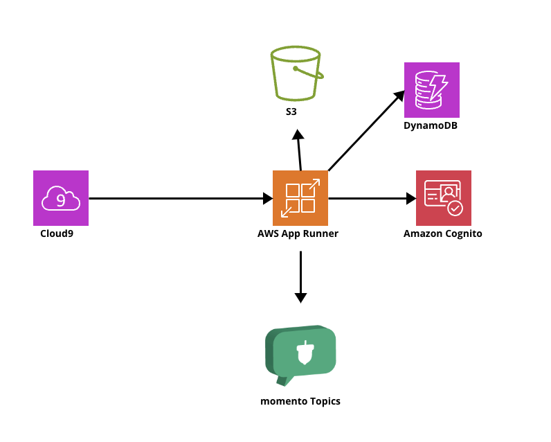

# 学習目的
前半のワークショップではMomentoについての概要、使うためにどうすればよいのかなど初期構築からMomentoコンソールの見方、APIキーの発行の仕方についてを学んでいきます。

# 前提条件
* 利用できるAWS アカウントがあること

# 所要時間
* 前半については、全体を通して45分のワークショップを予定しております。

### はじめに: Momentoの概要についてをお話しします。

### 1. Momento コンソールへサインアップおよびAPIキーを作成する

#### Momento( https://jp.gomomento.com/ )にアクセスしてください。
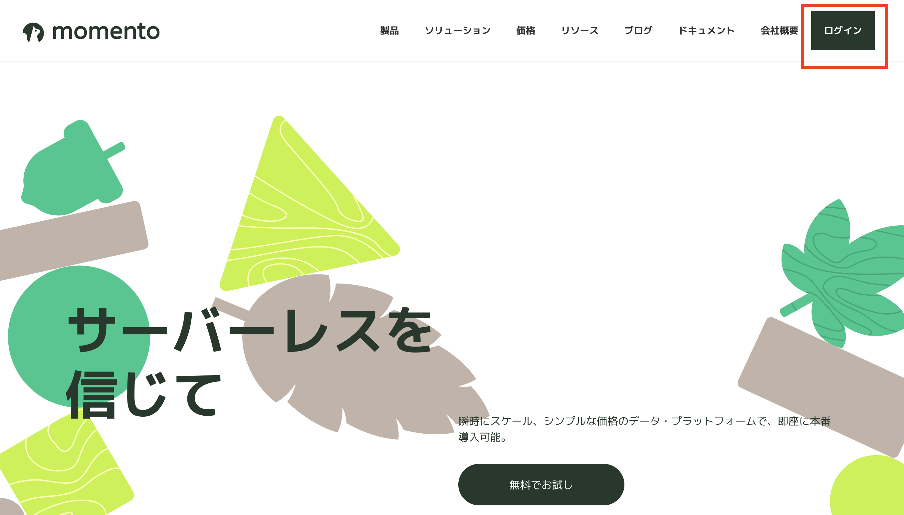

#### Momento Console からサインアップします。
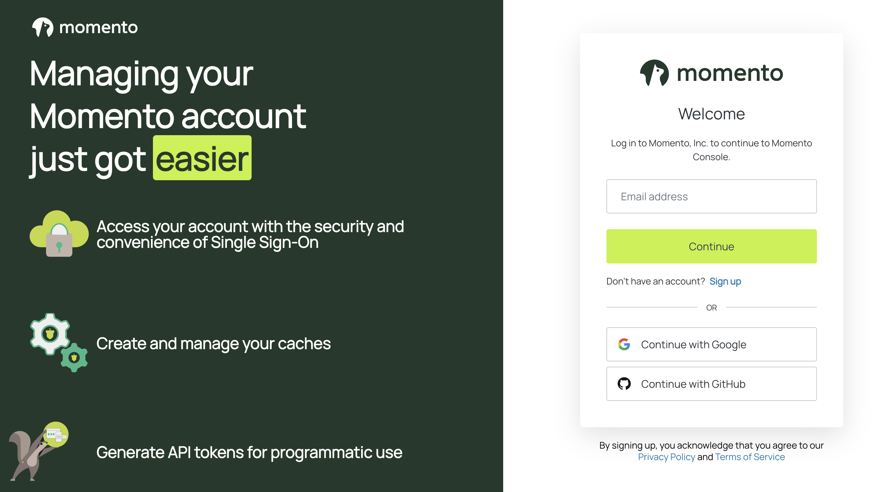

#### momento cacheを作成してください。

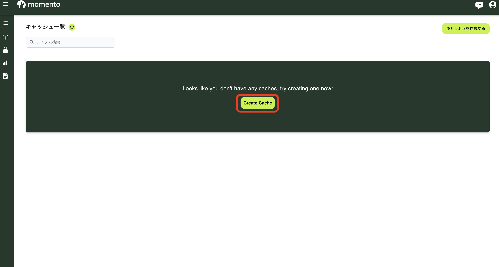

#### キャッシュ名に[example]を入力し、クラウドプロバイダー&リージョンに[aws]を、リージョンは[us-west-2]を選択し、「作成」を押す。

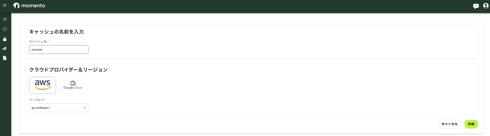


#### Momento SDKを使用するためにAPIキーを発行します。
* 左のタブにある[トークンの生成]を選択すると以下の画面が表示されます。
* 「Type of key」は「Super User Key」を選択します。
* ラウドプロバイダー&リージョンに[aws]を、リージョンは[us-west-2]を、Expirationは[30日]を選択いたします。
* 最後に「トークンを生成する」をクリックします。

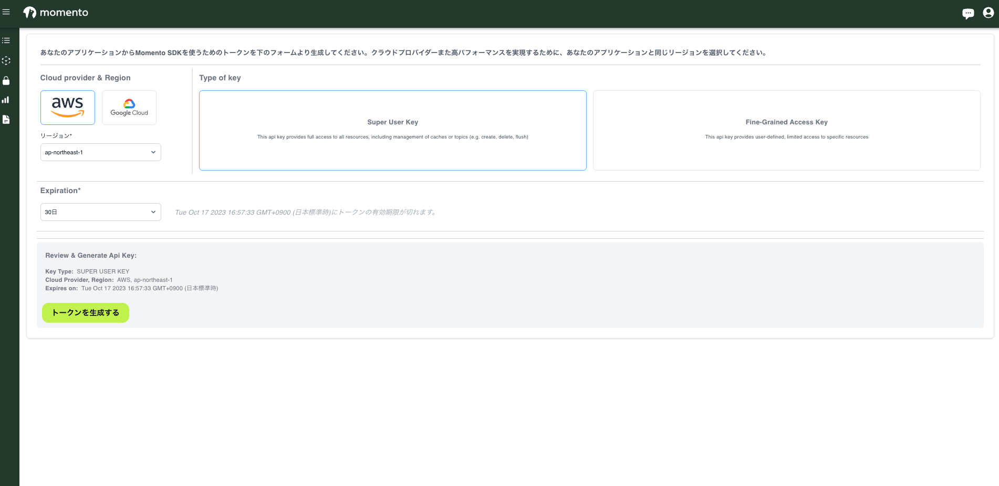

#### トークン、apiキーが生成されると下記のような画面になります。ここで、[JSONをダウンロード]をクリックしてください。
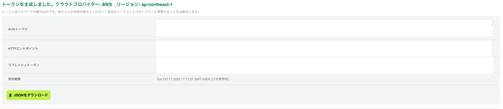

### Momento TopicsをMomentoコンソールから体験してみます。

### Momento Topicsを体験する為の設定をします。
* 左のタブにある「topics」を選択する。
* そうすると以下の画面になります。
* 「クラウドプロバイダー」には[aws]を選択し、「リージョン」には[us-west-2]を、「Cache」に[example]を設定します。
* 最後に、「Topics」に[test]を入力し、「Subscribe」をクリックします。

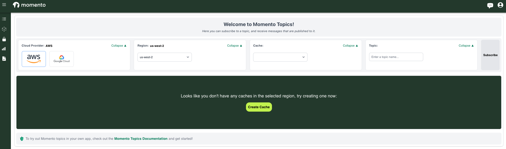

#### 体験してみましょう。
* 「Type your message...」にテキストを入力し、「Publish」をクリックするとメッセージの送受信ができることが確認できます。

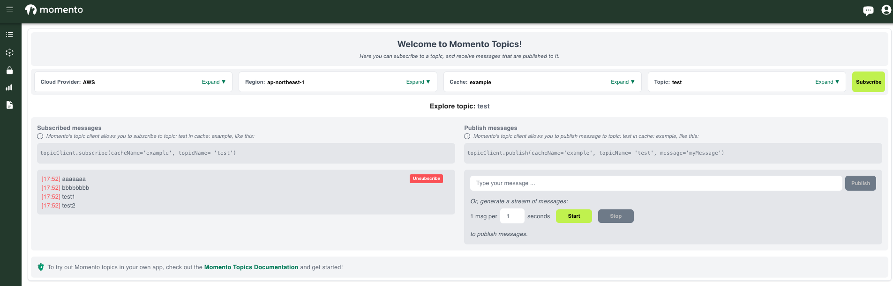

### AWSにて作業環境を構築
#### AWSへログイン
* 自身でお持ちのAWSアカウントへログインしてください。

#### Cloud9へアクセス
* マネジメントコンソールからCloud9へアクセスします。

AWS Cloud9 は、ブラウザだけでコードを作成、実行、デバッグできるクラウドベースの統合開発環境 (IDE) です。
コードエディター、デバッガー、ターミナルが含まれています。Cloud9 には、一般的なプログラミング言語に必要なツールと AWS コマンドラインインターフェイス (CLI) がプリインストールされているため、このワークショップのためにファイルをインストールしたりラップトップを設定したりする必要はありません。

Cloud9 環境は、AWS マネジメントコンソールにログインしたユーザーと同じ AWS リソースにアクセスできるようになります。

AWS Cloud9 の詳細については、以下のリソースをご覧ください。
* https://aws.amazon.com/cloud9/ 
* https://docs.aws.amazon.com/cloud9/latest/user-guide/welcome.html 

#### Cloud9にてワークスペースを作成する

* デフォルト設定の AWS Cloud9 アプローチに従います このワークショップに必要なCloud9インスタンスを作成します。

https://docs.aws.amazon.com/ja_jp/cloud9/latest/user-guide/tutorial-create-environment.html

* 「リージョン」は[us-west-2]を設定し、「環境作を作成」からワークスペースを作成します。

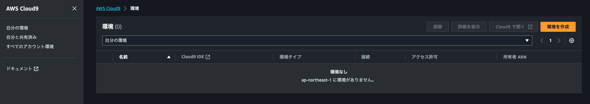

* 名前に[momento-workspace]を入力してください。
* 環境タイプはデフォストの状態で[新しいEC2インスタンス]のチェックボックスの入力のままにしておきます。
* 新しいEC2インスタンスにはデフォルトの状態のままで[t2.micro]のチェックボックスに入力されたままにしておきます。
* プラットフォームは[Amazon Linux 2]のままでタイムアウトは[30分]のままにします。
* ネットワーク設定については、接続を[AWS Systems Manager(SSM)]のままにします。
* VPCの設定もいじらずそのままとしましょう。
* 上記の状態でデフォルトの状態のまま[作成]をクリックしてください。

#### githubからのCloneを選択

* Cloud9のワークスペース[momento-workspace]の作成が完了するまで2~3分程度お待ちください。このタイミングで作成が完了しなかった場合は、講師にヘルプを求めてください。
* 完了し次第、下記の画面のようになるので、[開く]をクリックしてください。

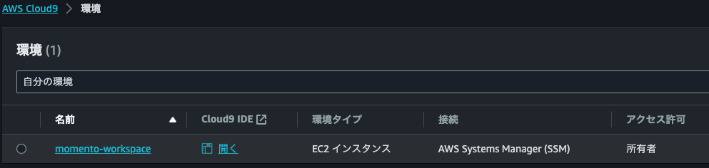


##### Cloud9を起動すると、ファイル ブラウザ、ファイル エディタ、ターミナルで構成される 3 つのウィンドウが表示されます。

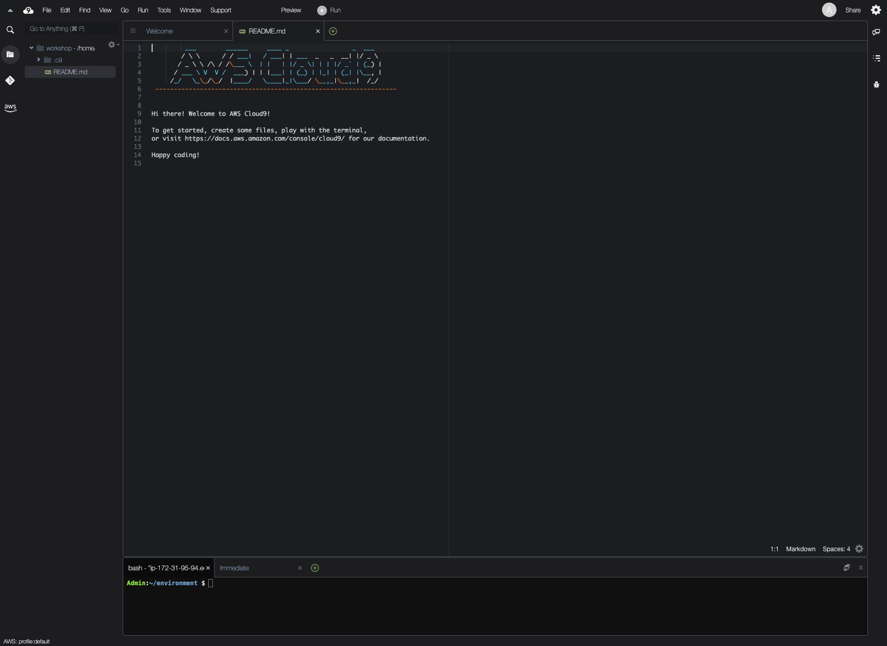


##### Cloud9を起動して。ディスクの拡張を行います。環境で使用されている Amazon EBS ボリュームのサイズ変更します。
サイズを変更したい Amazon EBS ボリュームの Amazon EC2 インスタンスに関連付けられている環境を開きます。

その環境用 AWS Cloud9 IDE で、以下の内容のファイルを作成し、resize.shを付けてファイル保存します。

```resize.sh
#!/bin/bash

# Specify the desired volume size in GiB as a command line argument. If not specified, default to 20 GiB.
SIZE=${1:-20}

# Get the ID of the environment host Amazon EC2 instance.
TOKEN=$(curl -s -X PUT "http://169.254.169.254/latest/api/token" -H "X-aws-ec2-metadata-token-ttl-seconds: 60")
INSTANCEID=$(curl -s -H "X-aws-ec2-metadata-token: $TOKEN" -v http://169.254.169.254/latest/meta-data/instance-id 2> /dev/null)
REGION=$(curl -s -H "X-aws-ec2-metadata-token: $TOKEN" -v http://169.254.169.254/latest/meta-data/placement/region 2> /dev/null)

# Get the ID of the Amazon EBS volume associated with the instance.
VOLUMEID=$(aws ec2 describe-instances \
  --instance-id $INSTANCEID \
  --query "Reservations[0].Instances[0].BlockDeviceMappings[0].Ebs.VolumeId" \
  --output text \
  --region $REGION)

# Resize the EBS volume.
aws ec2 modify-volume --volume-id $VOLUMEID --size $SIZE

# Wait for the resize to finish.
while [ \
  "$(aws ec2 describe-volumes-modifications \
    --volume-id $VOLUMEID \
    --filters Name=modification-state,Values="optimizing","completed" \
    --query "length(VolumesModifications)"\
    --output text)" != "1" ]; do
sleep 1
done

# Check if we're on an NVMe filesystem
if [[ -e "/dev/xvda" && $(readlink -f /dev/xvda) = "/dev/xvda" ]]
then
# Rewrite the partition table so that the partition takes up all the space that it can.
  sudo growpart /dev/xvda 1
# Expand the size of the file system.
# Check if we're on AL2
  STR=$(cat /etc/os-release)
  SUB="VERSION_ID=\"2\""
  if [[ "$STR" == *"$SUB"* ]]
  then
    sudo xfs_growfs -d /
  else
    sudo resize2fs /dev/xvda1
  fi

else
# Rewrite the partition table so that the partition takes up all the space that it can.
  sudo growpart /dev/nvme0n1 1

# Expand the size of the file system.
# Check if we're on AL2
  STR=$(cat /etc/os-release)
  SUB="VERSION_ID=\"2\""
  if [[ "$STR" == *"$SUB"* ]]
  then
    sudo xfs_growfs -d /
  else
    sudo resize2fs /dev/nvme0n1p1
  fi
fi
```

IDE のターミナルセッションから、resize.sh ファイルが格納されているディレクトリに移動します。それから次のコマンドを実行し、100 を Amazon EBS ボリュームのリサイズとして希望する Gib 単位のサイズに置き換えます。

```
bash resize.sh 100
```

```
chmod +x resize.sh
./resize.sh 100
```

#### 操作に必要なものをインストールする

* まずは、aws cliがダウンロードされていることを確認します。
```
$ aws --version
aws-cli/2.13.13 Python/3.11.4 Linux/4.14.322-244.536.amzn2.x86_64 exe/x86_64.amzn.2 prompt/off
```

* 次にGitがインストールされていることを確認します。

```
$ git --version
git version 2.40.1
```

* 問題がなければ、今回使用するソースコードをcloneしてきます。

```
 $ git clone https://github.com/Yoshiitaka/momento-topics-hands-on.git
Cloning into 'momento-topics-hands-on'...
remote: Enumerating objects: 169, done.
remote: Counting objects: 100% (169/169), done.
remote: Compressing objects: 100% (108/108), done.
remote: Total 169 (delta 63), reused 147 (delta 47), pack-reused 0
Receiving objects: 100% (169/169), 1010.95 KiB | 11.75 MiB/s, done.
Resolving deltas: 100% (63/63), done.
```

* 無事cloneが完成すると以下のようにcloud9上は表示されます。

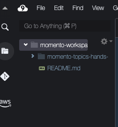

* 最後にチェックしていただきたいのは、sam cliがインストールされていることを確認いたします。
* 今回はデータストアとなるDynamoDBやオブジェクトストレージにはS3を使用しています。それら資源については、SAMを利用し資源を作成するような流れとなります。

```
$ sam --version
SAM CLI, version 1.72.0
```

### SAMを利用し、データストアを構築

* まず、初めにデータストアの資源を作成していきます。
* 下記のディレクトリへ移動してください。

```
cd momento-topics-hands-on/serverless/
```

* 次にエディタも開いていきます。momento-topics-hands-on/serverless/template.yamlを開いてください。

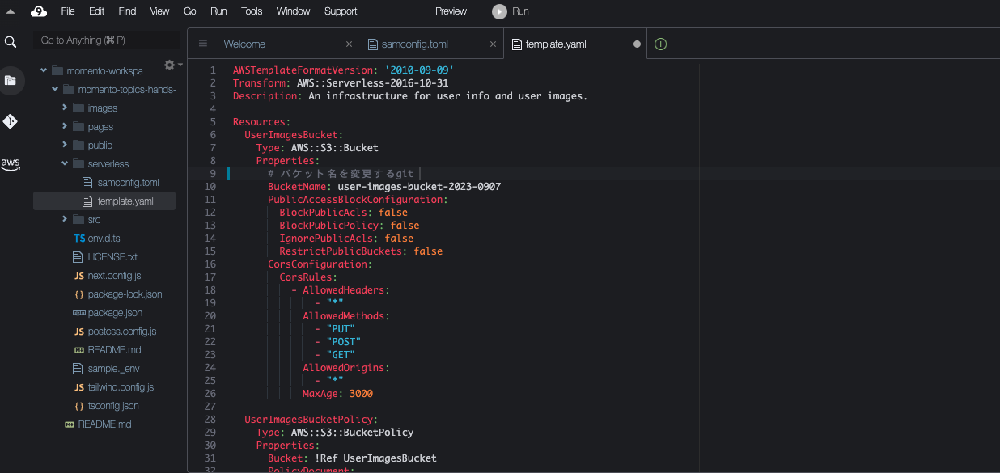

* template.yamlを更新する必要がございます。
* 9行目のコードで`BucketName`と書かれた箇所の値を更新してください。
* 例えば、[momento-workshop-202309-koitabashi]のように他のユーザと被らない値であればなんでもよいです。

* 修正が完了したら、`sam deploy`コマンドで資源を作成していきます。

```
$ sam deploy
```

* コンソール上で下記の内容が表示されたら、`Y`を入力する。
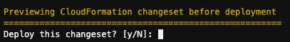

* うまくいくと下記のように表示されます。

```
Successfully created/updated stack - sam-app in us-west-2
```

### SNSチャットアプリを構築する
#### 環境変数の設定
##### 操作1: [sample_env]の名前を[.env.local]に変更する
##### 操作2: 次に、「.env.local」に記述されている[NEXT_PUBLIC_MOMENTO_AUTH_TOKEN]に先ほどダウンロードしてきた「momento_key_info.json」に記述されている[apiKey]の値をコピペします。次に[NEXT_PUBLIC_MOMENTO_CACHE_NAME]には、先ほどMomentoコンソールで作成したキャッシュ名を記述します。変更がなければ[example]を記述します。
##### 操作3: 「Amazon Cognito」に移動し、「IDプール」を選択します。[CognitoIdentityPool_XXXXXX]という「IDプール名」で新規のIDプールが作成されていると思うので、その[IDプールのID]をコピーします。その後、「.env.local」に記述されている[NEXT_PUBLIC_COGNITO_IDENTITY_POOL]にIDプールのIDを貼り付けます。
##### 操作4: momento-topics-hands-onディレクトリ上で `npm i`を実施します。

##### 操作5: momento clientを作成する
* src/utils/momento-web.tsに移動し、42行目に以下のコードを追加してください。

```

async function getNewWebClients(): Promise<MomentoClients> {
  const token =  process.env.NEXT_PUBLIC_MOMENTO_AUTH_TOKEN || ""
  const topicClient = new TopicClient({
    configuration: Configurations.Browser.v1(),
    credentialProvider: CredentialProvider.fromString({
      authToken: token,
    }),
  });
  return {
    topicClient,
  };
}

```

#### AWS App Runnerへチャットアプリをデプロイします。
##### 操作6: 一時認証ではなく、EC2のインスタンスロールでのDeployとする
* copilot を使用し、deployする際には一時クレデンシャルを使用しないよう設定する必要があります。
* cloud9上にて、左上のcloud9のアイコンをクリックすると「Preferences」から「AWS Setting」をクリックします。
* その後、下記の「AWS managed temporary credentials」をオフにします。

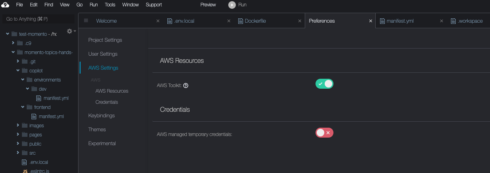

##### 操作7: cloud9の基盤となるEC2インスタンスに付与されているIAMロールに権限を付与します。

* 下記のCloud9のワークスペース情報が確認できるコンソール画面を別タブで開き「EC2インスタンスの管理」をクリックする。
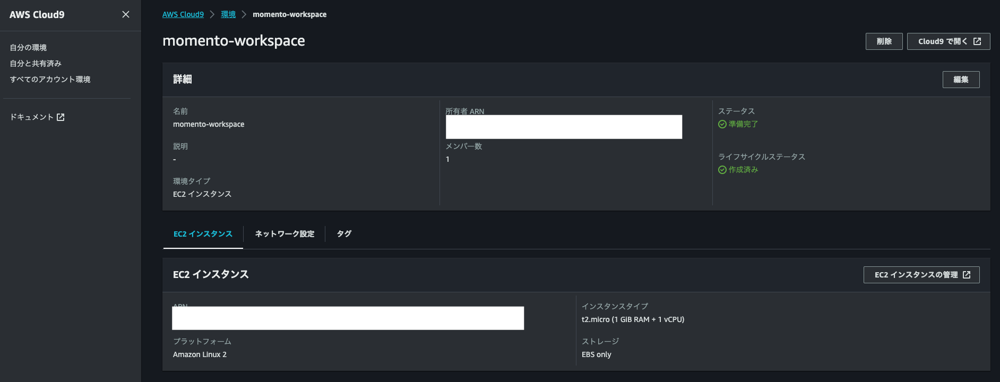

* その後、EC2インスタンスの画面から、「セキュリティ」をクリックし、[AWSCloud9SSMAccessRole]に一時的に[AdministratorAccess]権限を付与する。

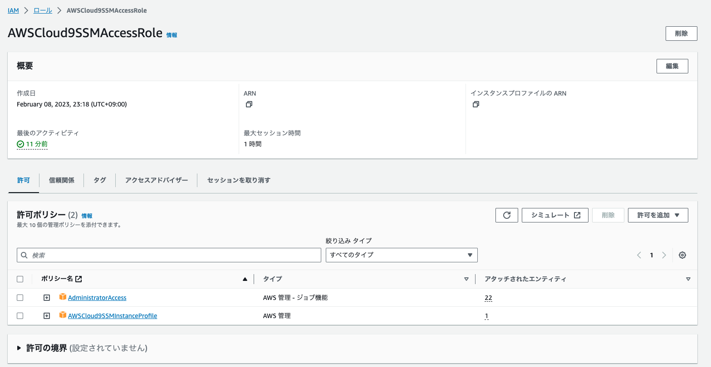

##### 操作8: 次に下記のコマンドにてcopilotをインストールしていきます。

```
$ curl -Lo copilot https://github.com/aws/copilot-cli/releases/latest/download/copilot-linux && chmod +x copilot && sudo mv copilot /usr/local/bin/copilot && copilot --help
```

※ [copilotについて](https://aws.github.io/copilot-cli/ja/docs/getting-started/install/)


##### 操作9: アプリの設定をする

* 下記のコマンドでcopilotの設定をしていきます。

```
$ pwd
/home/ec2-user/environment/momento-topics-hands-on

$ export AWS_REGION=us-west-2
$ copilot app init
```

* 下記の質問に答えていきます。
まず最初に AWS Copilot Application を初期化します。`copilot app init` を実行しましょう。Application 名を聞かれるので `momento-workshop` と答えます。

```
 What would you like to name your application? [? for help]: momento-workshop
```

AWS Copilot は AWS CloudFormation を用いてリソースの管理を行います。CloudFormation のコンソールに移動してみると以下のようにスタックが 1 つ作成されていることがわかります。
もし AWS Copilot を使っていてエラーが出力されたときは CloudFormation の画面も見てみると原因究明がしやすいと思います。
また AWS Copilot は Application や Environment の情報を AWS Systems Manager Parameter Store で管理しています。Parameter Store の画面に移動してみるとこちらのようにmomento-workshop というパラメータが作成されています。Parameter Store で管理しているおかげで別の端末からも既存 Application を選択して操作することができます。手動ではこのパラメータに触らないようにしましょう。

###### AWS Copilot Environment を作成する
* 次に AWS Copilot Service が動くインフラ部分の Environment を作成します。

* Environment を初期化する時にはデフォルトの CIDR 設定で初期化することもできますし、CIDR を少しカスタマイズすることもできますし、既存の VPC をインポートすることもできます。Environment を作成するのは AWS クレデンシャルに記載されたアカウントのリージョンなので、別リージョンでも別アカウントでも同じようにEnvironment を作成することができます。VPC の設定項目にこだわりがなければ AWS Copilot のデフォルト設定で初期化する、細かい要件があったり VPC Peering している既存 VPC を使用したいといったネットワーク要件があれば既存 VPC をインポートして使うといった使い分けが可能です。

* 今回は新しく VPC を作るところから始めましょう。質問には以下のように答えます。最後の質問で No, I'd like to import existing resources と答えると現在のリージョンにある VPC 一覧からインポートする VPC を選ぶことができます。

```
$ copilot env init
```

> Environment name: dev と入力して Enter  
> Default environment configuration? : Yes, use default.   
を選択して Enter

コマンドの実行後は何やら CloudFormation を使ってリソースが作成されていますね。注意していただきたいのはこの瞬間にクラウド上に VPC が作成されているわけではないという点です。copilot/environments/dev/manifest.yml という Environment を定義した Manifest ファイルがローカルに作成されて Environment を操作する IAM Role などが作成されただけで、クラウド上にまだ VPC は作成されていません。必要であればこの Manifest ファイルを編集した上で copilot env deploy コマンドを実行して初めてクラウド上に VPC などのリソースが作成されます。

```
$ copilot env deploy
```

###### Request-Driven Web Service の作成

* Application, Environment が準備できたのでいよいよ Service を作成しましょう。途中の質問には以下のように回答します。

```
$ copilot svc init
```

> Service type: `Request-Driven Web Service`を選択して Enter  
Service name: `momento` と入力して Enter  
Would you like to accept traffic from your environment or the internet?: `Internet` を選択して Enter  
Which Dockerfile would you like to use for momento? `./Dockerfile` を選択して Enter  

###### Service をデプロイ

このコマンドを実行すると裏側で App Runner 用の ECR リポジトリを作成してくれます。痒いところに手が届いて便利ですね。

copilot/momento/manifest.yml を開いてみましょう。このファイルで Service を定義していて、ドキュメント にあるようにさらに細かく設定することもできます。App Runner は十分シンプルなサービスではありますが割り当てる CPU などのリソース定義や環境変数など最低限の設定は必要です。これにさらに VPC Connector の設定などが増えてくるとどこかで IaC の管理をしたくなってくるでしょう。そういった時に AWS Copilot は選択肢の 1 つになります。

では早速この Service をデプロイしましょう。

```
$ copilot svc deploy
```

### 動作確認
各々で確認していきます。

### お片付け

```
$ copilot app delete
Are you sure ~ ?: Y

$ cd serverless
$ sam delete
```

* IAMよりロールを選択し、[AWSCloud9SSMAccessRole]を絞り込む。
* 一時的に付与した[AdministratorAccess]権限を削除して終了。

#### Tips
* volumeが不足した場合
```
$ docker volume prune  
$ docker system prune
```
